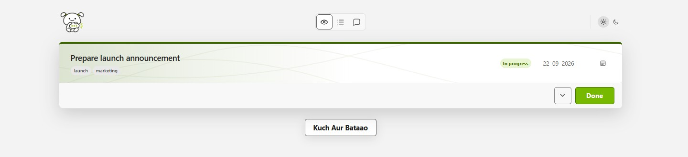
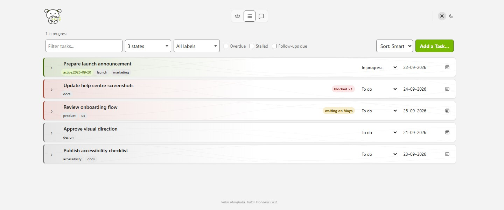
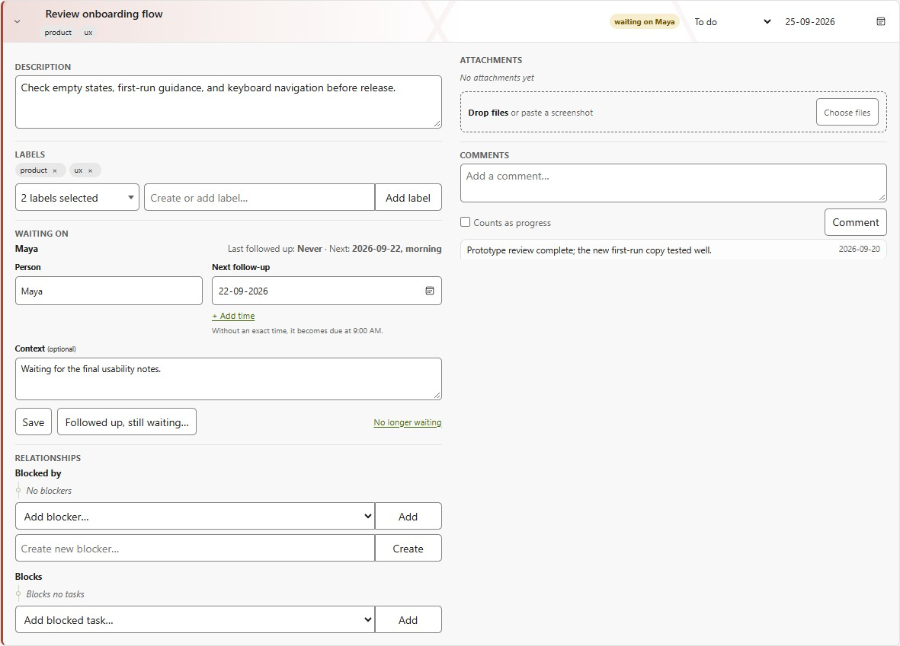

# Aur Bataao

Aur Bataao is a self-hosted, single-user task tracker that helps you choose the
next useful thing to do without losing sight of the full backlog. It runs in a
browser and keeps its task data in a local SQLite database.

## What you can do

- Work from a **Focused** view that presents one actionable task or due
  follow-up at a time. Use **Kuch Aur Bataao** when you want another suggestion.
- Manage the complete backlog in **All Tasks**, with search, state and label
  filters, overdue, stalled, and follow-up filters, plus smart or manual rank
  ordering. The label filter also provides a manager for deleting labels that
  are no longer assigned to any task.
- Track titles, descriptions, due dates, workflow state, labels, comments, and
  attachments. Files can be selected, dropped, or pasted from the clipboard.
- Record task relationships. A task stays blocked until its unfinished blocker
  tasks are completed.
- Mark a task as waiting on someone, record follow-ups, and schedule the next
  reminder for a date or exact time.
- Switch between light and dark themes; your display and sorting preferences
  are remembered in the browser.
- Optionally use an AI agent to inspect tasks, discuss plans, and propose
  changes. Read-only actions run automatically, while every data change waits
  for your approval.

Workflow state is deliberately simple: **To do**, **In progress**, or **Done**.
Being blocked by another task or person is tracked separately, so the original
workflow state is preserved.

## See it in action

These screenshots use a temporary database populated only with synthetic demo
data. No task, person, attachment, conversation, or setting from a real Aur
Bataao database is included.

### Stay focused on the next useful action



### Scan and filter the complete backlog



### Keep the supporting context with the work



## Get started

Aur Bataao requires Python 3.11 or newer. Run these commands from the project
directory.

### Windows PowerShell

```powershell
py -3 -m venv .venv
.\.venv\Scripts\python.exe -m pip install -e .
.\.venv\Scripts\python.exe start.py
```

### Linux or macOS

```bash
python3 -m venv .venv
./.venv/bin/python -m pip install -e .
./.venv/bin/python start.py
```

The launcher opens <http://127.0.0.1:8080> in your default browser. Keep its
terminal open while using the app, and press `Ctrl+C` to stop it cleanly.

On first launch, Aur Bataao creates its database and attachment directory
automatically. No account or separate database server is required.

## A quick tour

1. Select **Add a Task...**, enter a title, and optionally attach files.
2. Open a task's details to add context, labels, relationships, comments, or a
   waiting-on reminder.
3. Use **Focused** for the next available task. Due follow-ups are surfaced
   there too.
4. Use **All Tasks** to search, filter, edit, or reorder the backlog. Select
   **Sort: Rank** before dragging a task; the rank handle also supports the
   arrow keys.
5. Mark work **Done** when complete. Finishing a blocker automatically makes
   its dependent tasks available when no other blocking reason remains.

A date-only follow-up becomes due at 9:00 AM in the configured timezone. After
contacting someone, choose **Followed up, still waiting...** to keep the history
and schedule the next reminder. Choose **No longer waiting** to remove only the
person-based block.

## Optional AI agent

The **Agent** view works with local or remote endpoints that implement the
OpenAI-compatible Chat Completions API.

1. Open **Agent**, expand **Endpoint settings**, and add an endpoint.
2. Enter its base URL and model ID, or use **Discover** if the endpoint supports
   model listing.
3. If authentication is required, enter the name of an environment variable
   containing the API key. Set that variable before starting Aur Bataao.
4. Leave **Endpoint supports tool calling** enabled only for models that can use
   OpenAI-style tools.
5. Start a conversation. Conversations are saved and can be arranged in
   folders.

Profiles store only the environment variable's name, never the secret value.
Chat-only models can still be used for conversation, but cannot inspect or
change task data. A remote provider receives the conversation and any task data
the agent reads through tools, so choose an endpoint you trust.

## Data, limits, and backups

By default, application data lives under `instance/`:

- `instance/tasks.sqlite3` contains tasks, labels, comments, relationships,
  waiting history, endpoint profiles, and agent conversations.
- `instance/attachments/` contains uploaded files.

Back up both paths together while the app is stopped. Restoring only the
database or only the attachments directory can leave attachment records and
files out of sync.

Each attachment may be up to 10 MB, each task may have up to 20 attachments,
and one upload request may contain up to 25 MB.

Aur Bataao has no login screen or multi-user access controls. Keep the default
loopback address unless access is protected by a trusted private network, VPN,
or authenticated reverse proxy.

## More setup and troubleshooting

See [DEVELOPER.md](DEVELOPER.md) for configuration variables, endpoint
examples, launcher controls, development setup, API notes, debugging,
architecture, tests, coverage, and repository checks.
